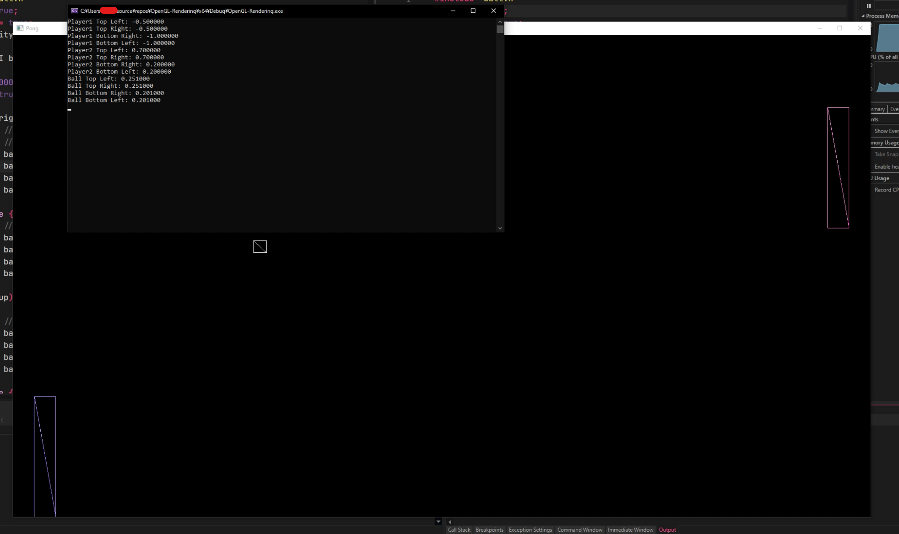

# Ping Pong but its OpenGL
I am trying to learn some graphics programming.   
My goal is just to learn not to make anything great.    
So don't expect some raytraced 200fps 8k game here.

### January 07 2024
I added a debug mode to see how the points are actually being drawn available by hitting F1.     
It displays corrdinates of all points in the terminal and changes the glPolygonMode to GL_LINE rather then GL_FILL.    
I hate the code yes.... but I am going to keep moving forward improving my skills. I might even start working on some 3d stuff.

### January 05 2024
Learning some more OpenGL rendering which is alot harder but I am here to learn not to loose
   

